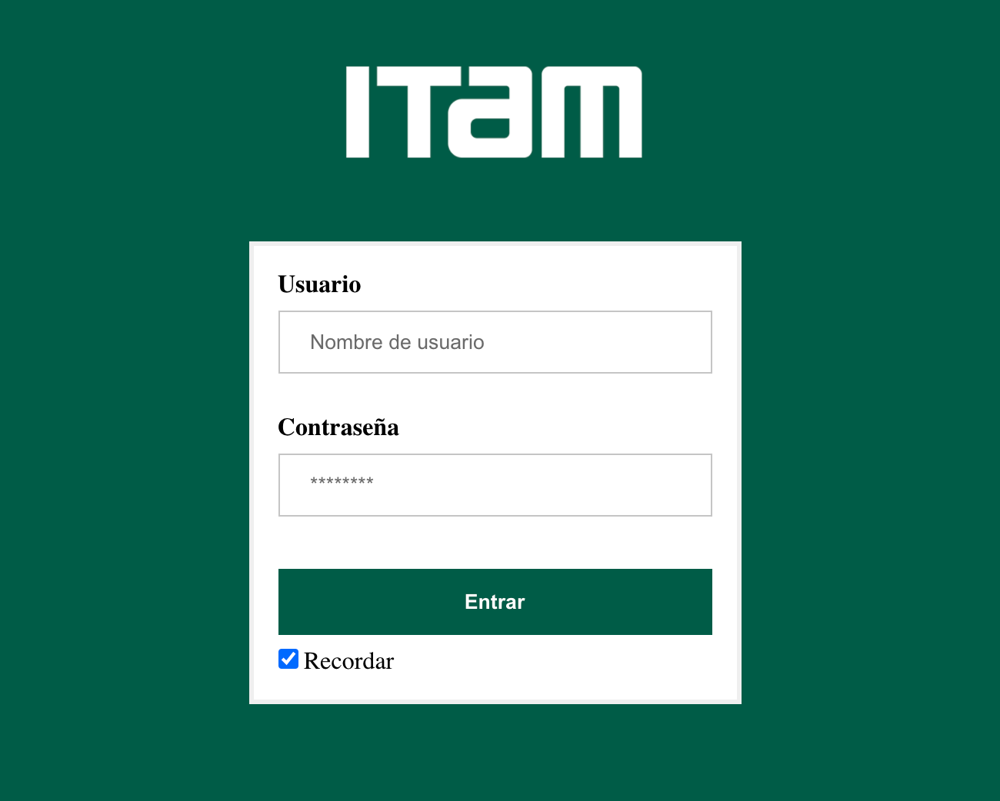

# Chat-ITAM

Prototipo de una aplicación web para simular un chat para los estudiantes del ITAM.
Esta aplicación fue desarollada para la materia de Ingeniería de software en el semestre
otoño 2020.

